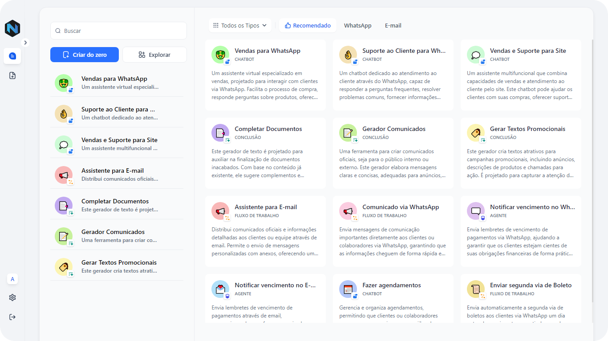

</a>

    
    

Dify é uma plataforma de desenvolvimento de aplicativos LLM de código aberto. Sua interface intuitiva combina fluxo de trabalho de IA, pipeline RAG, capacidades de agentes, gerenciamento de modelos, recursos de observabilidade e muito mais, permitindo que você passe rapidamente do protótipo à produção. Aqui está uma lista das principais funcionalidades:
   
 </a>

**1. Fluxo de Trabalho**: 
  Construa e teste fluxos de trabalho de IA poderosos em uma tela visual, aproveitando todos os recursos a seguir e muito mais.

 </a>

**2. Suporte Abrangente a Modelos**: 
  Integração perfeita com centenas de LLMs proprietários / de código aberto de dezenas de provedores de inferência e soluções auto-hospedadas, abrangendo GPT, Mistral, Llama3 e quaisquer modelos compatíveis com a API do OpenAI. Uma lista completa de provedores de modelos suportados pode ser encontrada [aqui](https://docs.dify.ai/getting-started/readme/model-providers).

</a>

**3. IDE de Prompt**: 
  Interface intuitiva para criar prompts, comparar desempenho de modelos e adicionar funcionalidades adicionais, como conversão de texto em fala em um aplicativo baseado em chat. 

**4. Pipeline RAG**: 
  Capacidades extensivas de RAG que cobrem tudo, desde a ingestão de documentos até a recuperação, com suporte pronto para extração de texto de PDFs, PPTs e outros formatos de documentos comuns.

**5. Capacidades de Agentes**: 
  Você pode definir agentes com base na Chamada de Função LLM ou ReAct e adicionar ferramentas pré-construídas ou personalizadas para o agente. Dify oferece mais de 50 ferramentas integradas para agentes de IA, como Google Search, DELL·E, Stable Diffusion e WolframAlpha.

**6. LLMOps**: 
  Monitore e analise logs de aplicativos e desempenho ao longo do tempo. Você pode melhorar continuamente prompts, conjuntos de dados e modelos com base em dados de produção e anotações.

**7. Backend-como-um-Serviço**: 
  Todas as ofertas do Dify vêm com APIs correspondentes, para que você possa integrar o Dify sem esforço na sua lógica de negócios.

## Comparação de Recursos
<table style="width: 100%;">
  <tr>
    <th align="center">Recurso</th>
    <th align="center">Dify.AI</th>
    <th align="center">LangChain</th>
    <th align="center">Flowise</th>
    <th align="center">API de Assistentes OpenAI</th>
  </tr>
  <tr>
    <td align="center">Abordagem de Programação</td>
    <td align="center">Orientado para API + Aplicativo</td>
    <td align="center">Código Python</td>
    <td align="center">Orientado para Aplicativo</td>
    <td align="center">Orientado para API</td>
  </tr>
  <tr>
    <td align="center">LLMs Suportados</td>
    <td align="center">Variedade Rica</td>
    <td align="center">Variedade Rica</td>
    <td align="center">Variedade Rica</td>
    <td align="center">Somente OpenAI</td>
  </tr>
  <tr>
    <td align="center">Motor RAG</td>
    <td align="center">✅</td>
    <td align="center">✅</td>
    <td align="center">✅</td>
    <td align="center">✅</td>
  </tr>
  <tr>
    <td align="center">Agente</td>
    <td align="center">✅</td>
    <td align="center">✅</td>
    <td align="center">❌</td>
    <td align="center">✅</td>
  </tr>
  <tr>
    <td align="center">Fluxo de Trabalho</td>
    <td align="center">✅</td>
    <td align="center">❌</td>
    <td align="center">✅</td>
    <td align="center">❌</td>
  </tr>
  <tr>
    <td align="center">Observabilidade</td>
    <td align="center">✅</td>
    <td align="center">✅</td>
    <td align="center">❌</td>
    <td align="center">❌</td>
  </tr>
  <tr>
    <td align="center">Recursos Empresariais (SSO/Controle de Acesso)</td>
    <td align="center">✅</td>
    <td align="center">❌</td>
    <td align="center">❌</td>
    <td align="center">❌</td>
  </tr>
  <tr>
    <td align="center">Implantação Local</td>
    <td align="center">✅</td>
    <td align="center">✅</td>
    <td align="center">✅</td>
    <td align="center">❌</td>
  </tr>
</table>

## Usando o Dify

- **Nuvem  **
Hospedamos um serviço [Dify Cloud](https://dify.ai) para qualquer pessoa experimentar sem configuração. Ele fornece todas as capacidades da versão auto-hospedada e inclui 200 chamadas gratuitas ao GPT-4 no plano sandbox.

- **Auto-hospedagem da Edição Comunitária do Dify **
Coloque rapidamente o Dify em funcionamento no seu ambiente com este [guia inicial](#quick-start).
Use nossa [documentação](https://docs.dify.ai) para referências adicionais e instruções mais detalhadas.

- **Dify para empresas / organizações **
Oferecemos recursos adicionais centrados em empresas. [Agende uma reunião conosco](https://cal.com/guchenhe/30min) ou [envie-nos um e-mail](mailto:business@dify.ai?subject=[GitHub]Business%20License%20Inquiry) para discutir necessidades empresariais.
